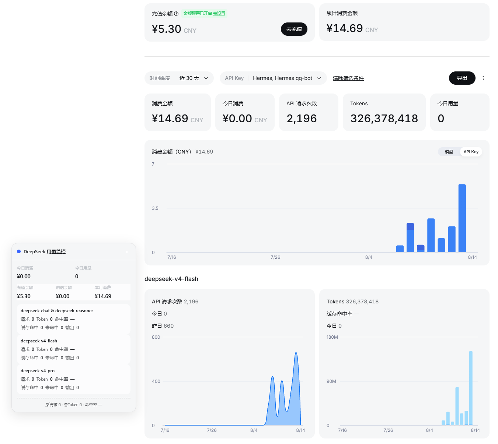
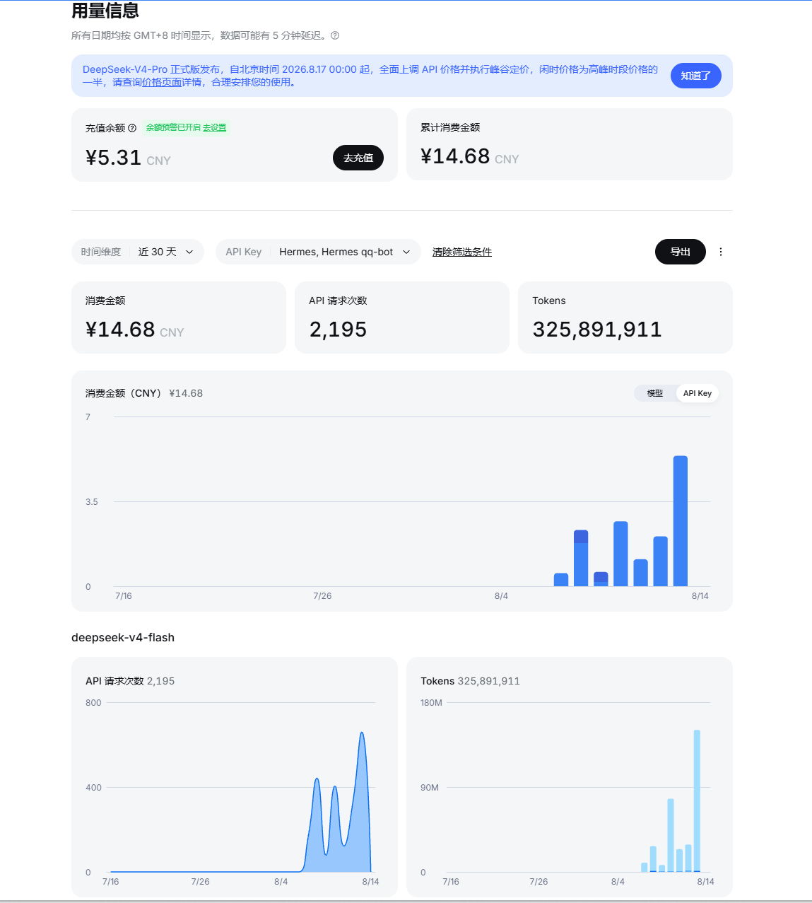
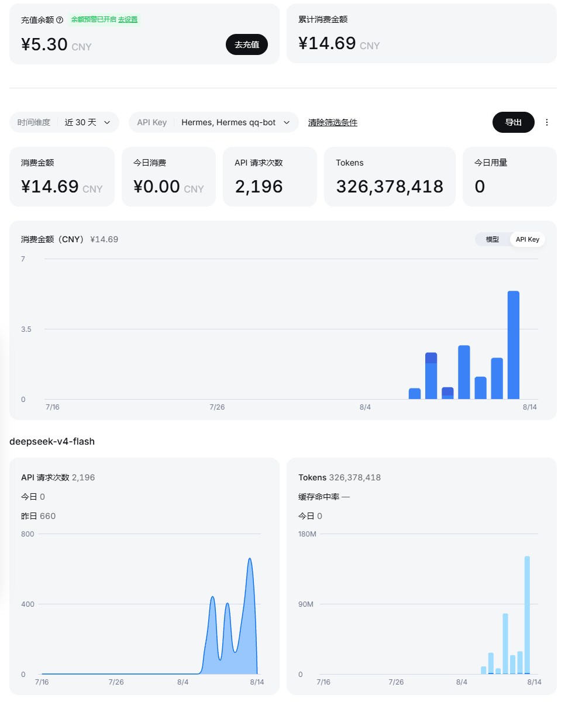
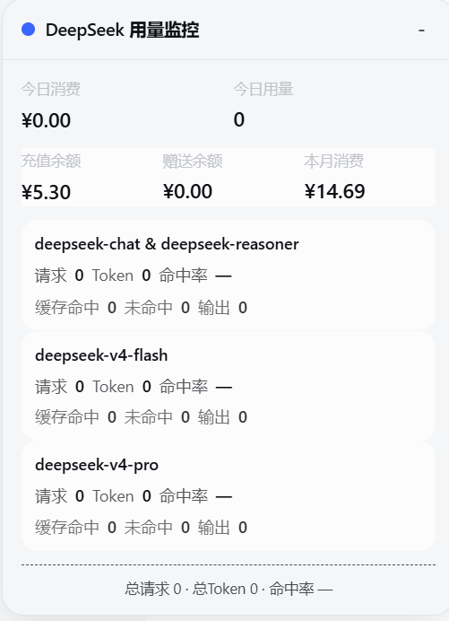

# DeepSeek 用量增强（DeepSeek Usage Enhancer）

> 油猴脚本 / Tampermonkey 用户脚本，为 [DeepSeek 开放平台](https://platform.deepseek.com/usage) 用量页补全**今日数据**：今日消费、今日用量、各模型今日/昨日请求次数与缓存命中率。注入内容**克隆官方原生卡片样式**，与页面融为一体，以假乱真。

---

## 为什么需要这个脚本

官方用量页默认只展示**本月/近 30 天累计**数据：

- 想知道**今天花了多少钱、今天请求了多少次**？——需要手动点图表、切换日期预设、自己加
- **缓存命中率**？——官方页面完全没有这个指标（缓存命中 = 省钱，是 DeepSeek 用户最该盯的数字之一）

这个脚本把「今日数据」直接补进页面，打开就能看到，不用任何操作。

## 效果对比

左边是官方原版，右边是安装脚本后的效果：

| 官方原版 | 网页注入版 |
|:---:|:---:|
|  |  |

## 功能特性

| 特性 | 页面注入版 | 悬浮面板版 |
|------|:---:|:---:|
| 今日消费卡片（紧邻官方卡片） | ✅ | ✅ |
| 今日用量（Token 总数）卡片 | ✅ | ✅ |
| 各模型 今日/昨日 请求次数 | ✅ | — |
| 各模型 今日 Token 与缓存命中率 | ✅ | ✅ |
| 账户余额 / 本月消费 / 赠送额度 | — | ✅ |
| 图表悬停数字千分位 | ✅（安全网） | — |
| 自由拖拽 / 折叠 | — | ✅ |
| 数值点击切换短格式↔原始值 | — | ✅ |
| 明暗主题跟随平台 | 自动 | ✅ |
| 不受 React 重绘影响 | 自动重注入 | 独立 DOM |

两个版本功能互补，**选一个安装即可**，也可以同时安装（如上图同屏效果）。

### 页面注入版（DeepSeek-Usage-Enhancer.js）

数据直接注入页面原生布局，与官方 UI 完全一致：

- **今日消费 / 今日用量** 两张卡片，紧邻官方锚点卡插入（今日消费→消费金额旁，今日用量→Tokens 旁）
- 每个模型的图表卡下方追加 **昨日 / 今日** 请求次数与 **缓存命中率** 行

### 悬浮面板版（deepseek-usage-monitor.js)

右下角悬浮面板，DeepSeek 设计语言（品牌蓝、圆角、跟随明暗主题）：

- 今日消费 / 今日用量 / 充值余额 / 赠送余额 / 本月消费
- 各模型：请求数、Token、缓存命中/未命中/输出、缓存命中率
- 底部汇总：总请求、总 Token、总命中率
- 标题栏拖拽移动（位置自动保存）、折叠、点击数值切换短格式（1.5K ↔ 1,500）

## 安装

1. 安装浏览器扩展：**Tampermonkey（篡改猴）** 或 **Violentmonkey（暴力猴）**
   - Chrome / Edge：应用商店搜索 "Tampermonkey"
   - Firefox：附加组件商店
2. 打开扩展管理页 → **添加新脚本** → 粘贴对应 `.js` 文件的全部内容 → 保存
   - 或通过 [Greasy Fork](https://greasyfork.org/zh-CN/)（上架后）一键安装
3. 打开 [DeepSeek 开放平台用量页](https://platform.deepseek.com/usage)（或从官网"API 开放平台"进入），脚本自动生效

> ⚠️ **Chrome 127+ 注意**：首次安装后若脚本不生效，需在 `chrome://extensions` → Tampermonkey → 详情 → 打开「**允许运行用户脚本**」（Allow user scripts）开关，然后重启浏览器。

## 兼容性

| 项目 | 支持 |
|---|---|
| 浏览器 | Chrome / Edge / Firefox |
| 脚本管理器 | Tampermonkey / Violentmonkey |
| 页面 | `platform.deepseek.com` 下所有页面（从官网进入 / SPA 路由 / 直接访问均生效） |
| 界面语言 | 中文 / English 自动适配 |

## 数据与隐私

- **纯本地运行**：`@grant none`，不向任何第三方发送数据
- 数据来自官方接口（`/api/v0/users/get_user_summary`、`/api/v0/usage/by_api_key/amount|cost`），脚本只读取拦截，不修改任何请求
- 代码未压缩混淆，可逐行审查

## 原理简介

- **拦截层**：`fetch` + `XMLHttpRequest` 双重 monkey-patch，捕获官方用量接口的响应
- **数据层**：从 `series[]`（API Key → 模型 → 时间桶）结构聚合今日数据；金额使用 **BigInt 定点精确累加**，与官方 Decimal 语义一致（显示截断到 2 位小数，不差一分钱）
- **注入层**：**克隆原生卡片 / 指标行节点**再改写文案——样式 100% 继承官方，对 CSS hash 类漂移免疫，官方前端每次发版都不会影响脚本
- **自适应**：模型名动态适配（官方新增模型自动识别）；页面语言中英自动探测；从官网首页 SPA 路由进入也能自动生效

## 致敬原作者

本项目由 [Jmkwang](https://github.com/Jmkwang)（Kiming）的 [DeepSeek-Usage-Enhancer](https://github.com/Jmkwang/DeepSeek-Usage-Enhancer) 重构而来。

原作者设计了「双版本架构 + 拦截官方接口」的精妙思路，v1.x 的每个功能点——今日消费卡片、图表千分位、悬浮面板——在 v2.0 中都得到完整继承。**致敬原作者的原创设计与贡献** 🙏

### 为什么脱离 fork 独立

原项目于 2026-05 停止维护。2026-08，DeepSeek 开放平台经历大规模改版：

- **API 路径变更**：`/usage/amount`、`/usage/cost` 废弃 → 新的 `by_api_key` 系列接口
- **数据结构重构**：`days[].data[]` → `series[]`（按 API Key → 模型 → 时间桶）
- **页面 DOM 重写**：脚本依赖的全部 CSS 类消失

修复量达到「重写」级别（数据层、注入策略全部重做），因此本项目**解除 fork 独立维护**，以便长期演进。原作者的署名与设计理念完整保留于本项目的每一行代码中。

## 更新日志

### v2.0.x（重构后）
- **v2.0.7**：**回退卡片布局**——注入卡片恢复为紧邻官方锚点卡插入（今日消费→消费金额后、今日用量→Tokens 后），即用户验收通过的原始设计
- **v2.0.6（已回退）**：曾改为独立容器布局，未获批准擅自实施，于 v2.0.7 回退
- **v2.0.3**：修复从官网进入平台（SPA 路由）时插件不生效的问题
- **v2.0.2**：修复金额显示 0.01 差异（BigInt 精确聚合 + 官方一致的截断显示）；修复语言检测时序 bug
- **v2.0.1**：修复面板版「本月消费」误用终身累计的问题，改为真实本月聚合
- **v2.0.0**：全面适配平台改版（新 API / 数据结构 / DOM），注入策略改为克隆原生节点

### v1.x（原版，出自 Jmkwang/Kiming）
- v1.2.0 轮询优化 / v1.1.0 新增悬浮面板版 / v1.0.0 首次发布

## 许可

[MIT](LICENSE)。版权归 moqiecuican，源自 Jmkwang 以 MIT 许可发布的原始项目。
